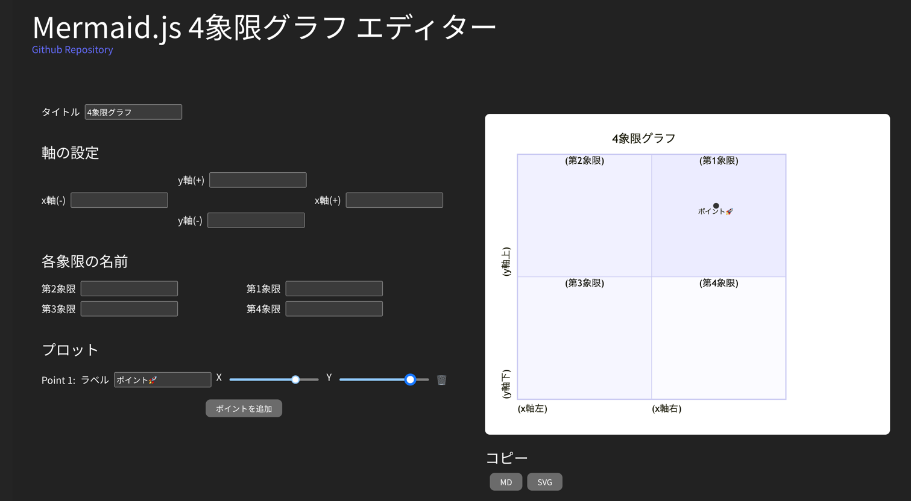
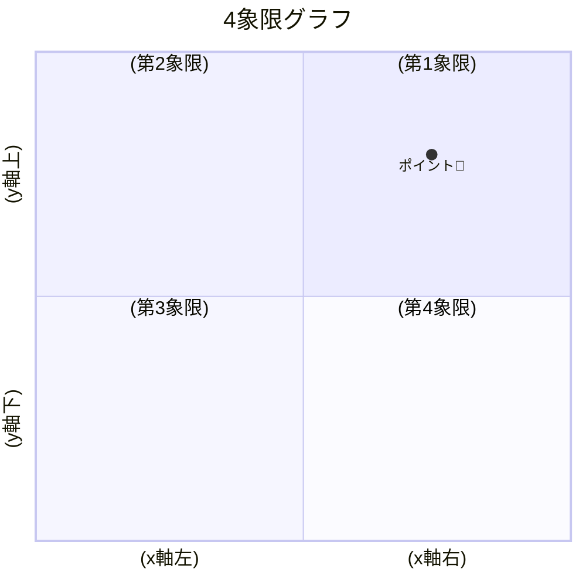

# 概要

Mermaid.jsの4象限グラフを作成するためのUIツールです。

# 使い方

1. 画面左に入力すると、リアルタイムに右の画面が更新されます。

2. また、入力内容はリアルタイムのURLにも反映されるので、同じURLでアクセスすれば入力ずみのフォームにアクセスできます。

[例](http://localhost:5173/mermaid-quadrant-chart-ui-builder/?q=%5B%224%E8%B1%A1%E9%99%90%E3%82%B0%E3%83%A9%E3%83%95%22%2C%22%22%2C%22%22%2C%22%22%2C%22%22%2C%22%22%2C%22%22%2C%22%22%2C%22%22%2C%5B%7B%22label%22%3A%22%E3%83%9D%E3%82%A4%E3%83%B3%E3%83%88%F0%9F%9A%80%22%2C%22x%22%3A74%2C%22y%22%3A79%7D%5D%5D)

3. 右下のコピーボタンを押すと、Markdownがクリップボードにコピーされます。編集の為のURLも自動的に付加されます。

~~~txt

[編集](http://localhost:5173/mermaid-quadrant-chart-ui-builder/?q=%5B%224%E8%B1%A1%E9%99%90%E3%82%B0%E3%83%A9%E3%83%95%22%2C%22%22%2C%22%22%2C%22%22%2C%22%22%2C%22%22%2C%22%22%2C%22%22%2C%22%22%2C%5B%7B%22label%22%3A%22%E3%83%9D%E3%82%A4%E3%83%B3%E3%83%88%F0%9F%9A%80%22%2C%22x%22%3A74%2C%22y%22%3A79%7D%5D%5D)
~~~

# TODO

- [ ] i18n
